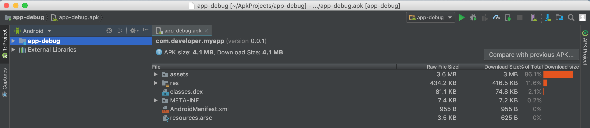
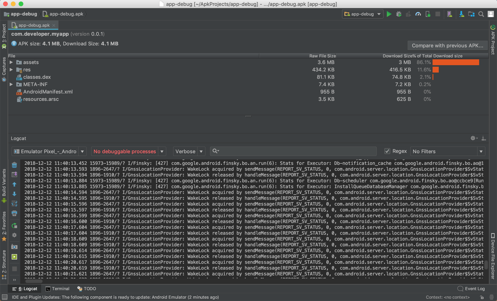

# 在 Android 上运行

## 项目配置

修改配置

```js
import { defineConfig } from 'alita';

export default defineConfig({
  appType: 'native',
  mobileLayout: true,
  packageId: 'com.alitajs.micro', // 更改为真实的包名
  displayName: 'micro', // 更改为真实的项目名称
});
```

> displayName，建议用英文，中文名称可在项目配置中修改，此处会被用做文件名。

## 添加平台

```bash
alita platforms --android
```

## 开发调试

使用环境变量 NATIVE 来区分构建平台

```bash
cross-env NATIVE=android alita dev
```

可在手机中下载 alita 开发者 app，进行扫码预览。

## 编译 build

使用环境变量 NATIVE 来区分构建平台

```bash
cross-env NATIVE=android alita build
```

## 在 Android Studio 上运行代码

打开 Android Studio，选择项目目录下的 Android 项目 `platforms/android`。

首次打开会有一个语法转化提示，点击确定即可，等待转换完成(首个项目开启，需要比较长的时间，因为需要下载 sdk 和 gradle 包)。


在 Android Studio 中，在编译器右上角，选择目标模拟器或设备（如果你都没有设备和模拟器，你可以根据指引添加一个模拟器），然后单击“播放”按钮。



### 查看原生日志

可以在 Android Studio 的 **Logcat** 中，查看到项目运行日志。

> 如果你的 Android Studio **Logcat** 是隐藏的，可以设置 **View** &raquo; **Tool Windows** &raquo; **Logcat** 显示。



## 实时开发调试

```bash
cross-env CORDOVA=android alita dev
```

> 直接启动开发服务器，Cli 创建的项目，可以执行 `start-android` ("start-android": "cross-env CORDOVA=android alita dev")

会开启一个 web 页面，会等待 cordova 加载完毕才会运行项目。你可以重新在 Android Studio 里面编译一下你的项目，就可以在设备上实时预览你的页面变更了。

## FAQ

待补充

## 使用 Cordova 的方式实现

修改配置

```ts
export default {
- appType: 'h5',
+ appType: 'cordova',
+ packageId: '',
+ displayName: '',
  mobileLayout: true
};
```

## 初始化 Cordova 项目

> 如果已经初始化过，就不用再执行初始化了。

```bash
alita cordova --init
```

> Cli 创建的项目，可以执行 `yarn cordova-init` ("cordova-init": "alita cordova --init")

## 添加 Android 原生代码

```bash
alita cordova --android
```

> Cli 创建的项目，可以执行 `cordova-add-android` ("cordova-add-android": "alita cordova --android",
> )

## 将代码编译到原生项目中

```bash
cross-env CORDOVA=android alita build
```

> 通过环境变量 CORDOVA=android 来匹配不同的平台，前面使用 cross-env 是为了消除电脑环境差异。在 mac 上 执行的是 `CORDOVA=android alita build`，而在 windows 上需要执行`set CORDOVA=android alita build`

> Cli 创建的项目，可以执行 `cordova-add-ios` ("build-android": "cross-env CORDOVA=android alita build")
