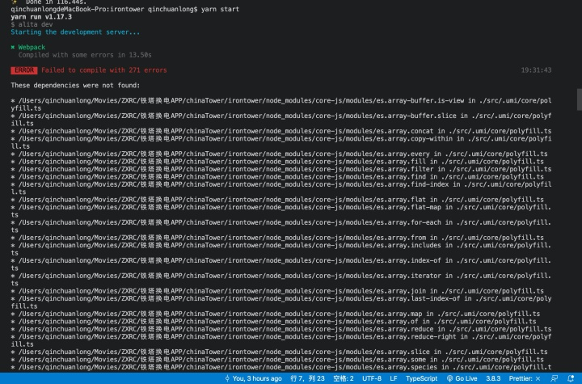

# 常见问题解答(FAQ)

## General

### alita 只能用 TypeScript 写吗？

是的。请使用 TypeScript 开发。

### import from alita 没有定义怎么办？

比如：

```js
import { history } from 'alita';
```

可能报 `xxx has no exported member 'history'`。

这时需要确保两件事，

1. tsconfig.json 中有配置 `@@` 的路径，比如 `"@@/*": ["src/.umi/*"]`，参考 [tsconfig.json 模板](https://github.com/umijs/umi/blob/master/packages/create-umi-app/templates/AppGenerator/tsconfig.json)
2. 确保 `src/.umi/core/umiExports.ts` 有相关内容，如果没有，可通过 `alita build`、`alita dev` 或 `alita g tmp` 任一命令生成

### 如何动态修改 title ？

在运行时配置中通过 titleList 配置修改。

## 报错

### `alita` 不是内部或外部命令

e.g.


需配置 NODE_PATH 环境变量，如使用 yarn，可通过执行 `yarn global bin` 拿到 bin 路径。

### The dependency was not found


一般是网络不好装包错误导致的，可以删除 `*.lock` 和 `node_modules` 重新执行 `yarn`，如果多次尝试都无法解决。可以在项目目录下执行 `git clean -dfx`，再重装，一般可以解决。

如果同一个项目你同事可以运行，你运行出错。一般都是缓存或者安装包过程出错问题。可以尝试删除几个缓存目录，比如删除 `src/.umi/cache` 后重试。

### \*\*\*/polyfill.tx



删除 `src/.umi/cache` 重启即可。

## 请求

### proxy 代理不成功,没有代理到实际地址


代理只是服务请求代理，这个地址是不会变的。
原理可以简单的理解为，在本地启了一个服务，你先请求了本地的服务，本地的服务转发了你的请求到实际服务器。所以你在浏览器上看到的请求地址还是http://localhost:8000/xxx 。以服务端是否收到请求为准

https://github.com/ant-design/ant-design-pro/issues/2779

## 部署

### build 之后图片丢失？

可能是图片没有正确引用，可以参考一下代码，正确引入图片。

```js
import React from 'react';
import logo from './logo.png'; // 告诉WebPACK这个JS文件使用这个图像

console.log(logo); // logo.84287d09.png

function Header() {
  // 导入图片
  return ;
}

export default Header;
```

在 css 中使用，注意不要使用绝对路径，可以使用别名 `~@` 对应到项目的 src 目录

```css
.Logo {
  background-image: url(～@/assets/logo.png);
}
```

> 注意：图片大小小于 10 k 时会走 base64。即不会被拷贝到 public 文件夹下，而是以 base64 的资源存在。
