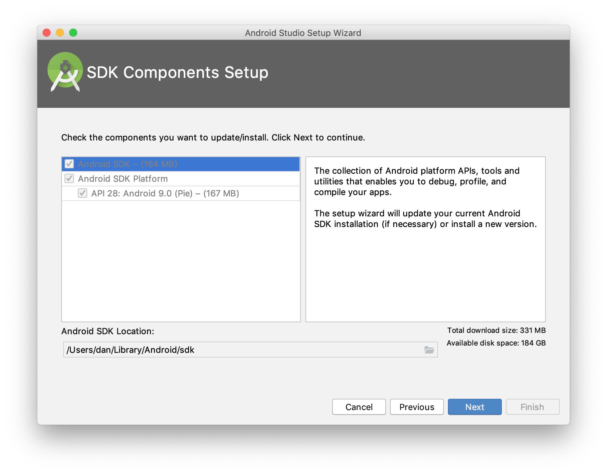
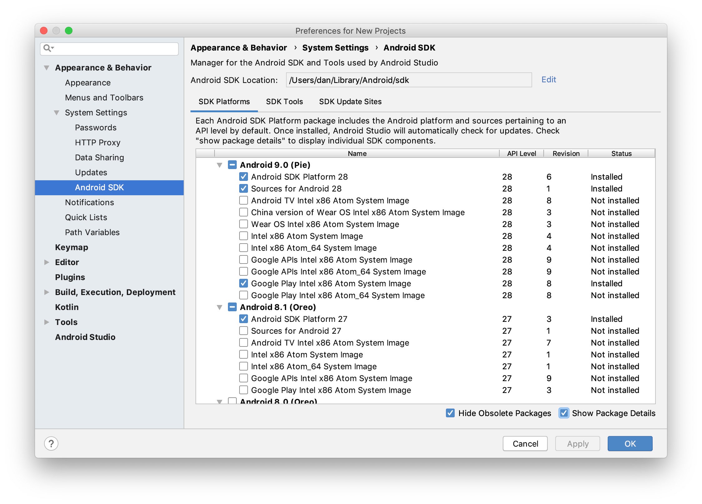
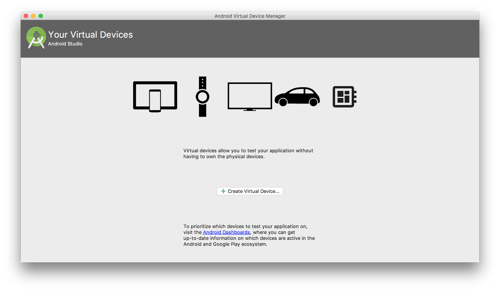
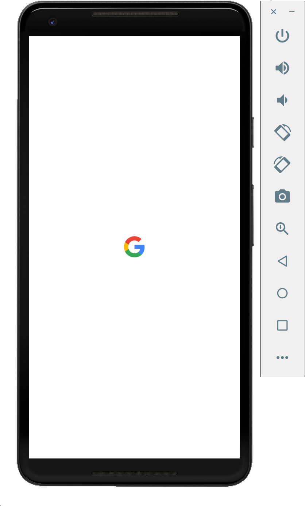

# 设置 Android 环境

要在 Android 平台使用，需要进行一些额外的设置。 可以在 Windows, macOS, 和 Linux 系统上创建 Android 应用。

## Android Studio

<a href="https://developer.android.com/studio/" target="_blank">Android Studio</a> 是用于创建原生 Android 应用程序的 IDE。 它包括<a href="/faq/glossary#android-sdk">Android SDK</a>。

> 我们不建议使用 Android Studio 开发应用程序。相反，它仅应真正用于构建和运行适用于原生 Android 平台的应用程序以及管理 Android SDK 和模拟器。

### 安装 Android Studio

从 <a href="https://developer.android.com/studio/" target="_blank">Android 网站</a>下载 Android Studio 。可在<a href="https://developer.android.com/studio/install" target="_blank">《用户指南》</a>中找到更详细的安装说明。

### 安装 Android SDK

安装完成后，打开 Android Studio。IDE 会检测到需要安装 Android SDK 。在**SDK Components Setup** 屏幕中，完成 SDK 的安装。记下 Android SDK 的位置。下面的环境配置中需要用到这个位置。



默认情况下，会安装最新的稳定 SDK 平台，其中包含针对该 Android 版本的软件包的集合。

要安装系统映像和其他次要 SDK 平台软件包，您可能需要确保在 SDK Manager 的底部选中了 **Show Package Details** 。



### 配置命令行工具

Android SDK 捆绑了一些有用的命令行工具。在使用它们之前，必须设置一些环境变量。以下说明适用于 macOS 和 Linux 。对于 Windows ，请查看有关在终端会话中设置和保留环境变量的文档。

在 `~/.bashrc`， `~/.bash_profile` 或类似的 shell 启动脚本中，进行以下修改：

设置 ANDROID_SDK_ROOT 环境变量。此路径应为上一节中使用的 Android SDK 位置。

1. 设置 `ANDROID_SDK_ROOT` 环境变量。此路径应为上一节中使用的 Android SDK 位置。

```shell
$ export ANDROID_SDK_ROOT=$HOME/Library/Android/sdk
```

将 Android SDK 命令行目录添加到中 `PATH`。每个目录对应于命令行工具的类别

1. 将 Android SDK 命令行目录添加到`PATH`中。每个目录对应于<a href="https://developer.android.com/studio/command-line/" target="_blank">命令行工具</a>。

```bash
# avdmanager, sdkmanager
export PATH=$PATH:$ANDROID_SDK_ROOT/tools/bin
# adb, logcat
export PATH=$PATH:$ANDROID_SDK_ROOT/platform-tools
# emulator
export PATH=$PATH:$ANDROID_SDK_ROOT/emulator
```

> 对于 `apksigner` 和 `zipalign`, `$ANDROID_SDK_ROOT/build-tools<version>` 还必须添加到`PATH`中。

### 创建一个 Android 模拟器

以下文档是设置 Android 模拟器的快速方法。有关更多详细说明和信息，请参阅<a href="https://developer.android.com/studio/run/managing-avds" target="_blank"> Android 文档</a>。

在 Android Studio 欢迎屏幕中，单击**Configure** &raquo; **AVD Manager**。也可以在**Tools** &raquo; **AVD Manager** 菜单中打开 `AVDs` 管理器。



单击**Create Virtual Device**，然后选择合适的设备。如果不确定，请选择 Pixel 2。然后，选择合适的系统映像。如果不确定，请选择带有 Google Play 服务的 Pie（API 28）。有关 Android 版本的信息，请参见<a href="https://en.wikipedia.org/wiki/Android_version_history" target="_blank">Android 版本历史记录</a>。

<figure class="device">
  
</figure>

### 设置 Android 设备(真机)

以下文档是设置 Android 设备进行开发的快速方法。有关更多详细说明和信息，请参阅<a href="https://developer.android.com/studio/run/device" target="_blank"> Android 文档</a>。

1. 在设备上启用 USB 调试。打开“设置”，导航至“开发人员”选项，然后启用 USB 调试。可能需要先启用“开发人员选项”菜单。有关说明，请参见<a href="https://developer.android.com/studio/debug/dev-options" target="_blank"> Android 文档</a>。
2. 确保设备具有连接到计算机的权限。对于 macOS，不需要其他设置。对于 <a href="https://developer.android.com/studio/run/oem-usb" target="_blank">安装 OEM USB 驱动程序</a>。

通过使用 USB 将设备连接到计算机并使用以下命令，验证连接是否有效：

```shell
$ adb devices
```

应该可以找到你的设备。如果遇到问题，请参阅完整的<a href="https://developer.android.com/studio/command-line/adb" target="_blank"><code>adb</code>文档</a>以获取故障排除和详细信息。

### Java

原生 Android 应用程序是使用<a href="https://java.com/en/" target="_blank"> Java </a>编程语言编译的。从<a href="https://www.oracle.com/technetwork/java/javase/downloads/jdk8-downloads-2133151.html" target="_blank">下载页面</a>下载 JDK8 。

> 如果你的电脑已经有 Java，那无需再次下载，但是请注意不要下载最新的 Java，可能存在兼容问题。
