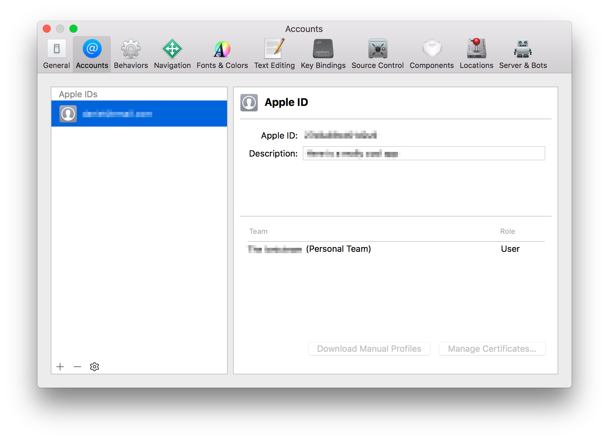
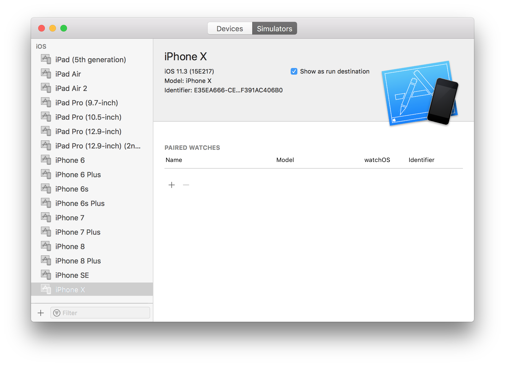

# iOS 设置

要开发 iOS 项目，需要添加 iOS 开发需要的环境配置，并且 iOS 项目开发，只能在 macOS 上进行，也就是说，你没办法在你的 windows 电脑上，构建 iOS 项目。

## Xcode

[Xcode](https://developer.apple.com/xcode/) 是用于创建本机 iOS 应用程序的 IDE 。它包括 iOS SDK 和 Xcode 命令行工具。可以通过 App Store 安装。

安装完 Xcode，请安装 Xcode 的命令行工具:

```shell
$ xcode-select --install
```

会自动弹出一个安装程序，点击 “安装”，并同意协议。


> 我们不建议使用 Xcode 开发应用程序。相反，它仅应真正用于构建和运行适用于本机 macOS 平台的应用程序以及管理模拟器。

### 开发者账号

所有 iOS 应用程序都必须经过代码签名，包括开发环境。通过配置 Apple ID 来使 Xcode 完成自动代码签名。

打开 Xcode 并导航到 **Xcode** &raquo; **Preferences** &raquo; **Accounts**。如果未列出任何 Apple ID，请添加。登录后，个人团队将出现在 Apple ID 的团队列表中。



> 如果你使用的是企业级证书，请联系你们的证书管理员，她会教你怎么做的。

### 创建一个 iOS 模拟器

iOS 模拟器模拟 Mac 上的 iOS 设备。以下文档是设置 iOS 模拟器的快速方法。有关更多信息，请参阅[Apple 文档](https://developer.apple.com/library/content/documentation/IDEs/Conceptual/simulator_help_topics/Chapter/Chapter.html)。

打开 Xcode 并导航到 **Window** &raquo; **Devices and Simulators**。如果尚不存在，请创建一个 **iPhone 11** 模拟器。



### 安装 ios-sim & ios-deploy

The [`ios-sim`](https://github.com/ios-control/ios-sim) and [`ios-deploy`](https://github.com/ios-control/ios-deploy) are utilities that deploy apps to the iOS simulator and iOS devices during development. They can be installed globally with [npm](/faq/glossary#npm).

该 [`ios-sim`](https://github.com/ios-control/ios-sim) 和 [`ios-deploy`](https://github.com/ios-control/ios-deploy) 是实用工具，部署应用到开发过程中的 iOS 模拟器和 iOS 设备。你可以通过以下命令安装。

```shell
$ npm install -g ios-sim
$ brew install ios-deploy
```
