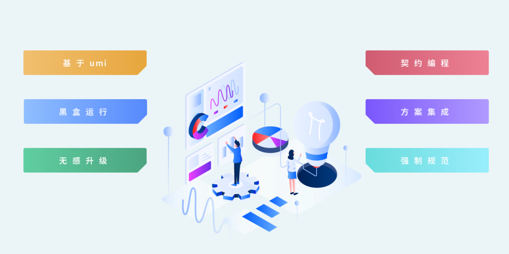

---
nav:
  title: '文档'
  order: 1
order: 1
nextText: '核心概念'
nextUrl: '/docs/intro/concepts'
---

# Alita 框架是什么？

项目开发与维护的艰辛众所周知，在复杂的需求和有限的时间内，我们希望集中更多精力在项目业务本身，而非受困于纷繁杂乱的文档、难以溯源的崩溃、错误频出的协作和无从下手的优化。

由此，Alita 应运而生，它的出现基于对开发者提效减负的初衷，是一套基于 Umi 的移动端框架，是面向场景化的开发提效方案。通过整合业务流程、简化技术开发，使得开发者能够更专注于业务能力的提升。

随着这几年前端工程化的发展，更多更复杂的业务被交到前端开发工程师的手上。前端开发已不仅仅是编写样式和逻辑代码。而是要涉及到更多前端代码的可靠性，可维护性，可扩展性还有应用的性能和开发效率等各个方面的思考。

暂且抛开工程化的技术不论，光从业务开发上，就常常会遇到以下几类难题：

- “表单开发”：表单控件是否可控，绑定关系是否正确，表单校验如何编写？
- “可视化图表”：市面上多个不同的可视化方案，如何选择，每个都有大量的文档，从何处开始阅读。
- “上拉加载更多”：列表页面是最常见的需求，却是最复杂的逻辑；
- “路由配置”：路由配置如何编写，如何嵌套，多人维护同一份配置文件，代码冲突如何有效规避？
- “整体布局”：某些页面需要底部导航，某些页面需要顶部导航，该写在哪？

随着业界的不断发展和新技术的不断涌现，越来越多的开发者开始注重自身的开发体验。带着这样的终极目标，Alita 开始逐步探索低门槛、高性能、易拓展、高效率的开发与维护方案，通过可插拔的特性，提升开发者体验，让开发者更多地专注于项目本身。并且提供大量的快速业务支撑方案，释放开发者在业务上的压力。

基于组件化开发思想，众所周知，将页面拆成合适的组件，会使代码更加可读和可维护，也使得组件复用更加的便利。由此，我们将项目分解成多个独立的页面，使得开发项目通常更容易维护，这消除了很多意料之外的页面交互，大大的降低项目的复杂度。

很多现有的 react 方案虽然做到了这一点，但仍需通过配置文件，或者项目主入口文件，将应用串联在一起。alita 重度采用 umi 的的约定式方案，它将配置的路由改成约定，采用文件及路由的面向契约编程的方案，移除项目中的路由配置文件。

针对不同的业务场景，通过封装一整套解决方案的方式来支撑，使得开发者用最少的精力和最小的学习成本编写最简的代码来实现最健壮的功能。

通过统一技术框架，达到多个项目基础技术栈的同步。

通过整合业务，实现多个产品中的优质功能能够共享到其他的项目中。

简而言之，alita 改变了原有对单个项目的独立管理，更专注于对整个技术方案的共同维护，使得技术栈维度体现了相互互补、相互支撑。目标不仅仅是产品能力的相互支撑，还有不同项目成员的灵活交换支撑。它协同所有项目成员采用相同的技术方案，使每个页面完全相互独立，以此保证不同项目具备“有效调整实时支撑人数”的能力。根据项目的轻重缓急，大大的增加需求单的完成量。

通过多个项目的共同沉淀，导出前端开发的最佳实践方案。还可以针对特定业务线，整理出更加合适的垂直领域的个性化项目构建体系。

对于业务和功能的封装，alita 都以“能不能只写一行代码就实现”的角度去设计和思考。针对当前业务上遇到的难题，抛弃“以后可能有的需求”的思想，进行针对性封装，在实践中遇难题解决难题，对组件进行扩展升级。同时 alita 具备导出升级方案，在实际项目中使用一行代码解决业务需求的组件。

基于 2019 年大半年的项目沉淀，它已经完成了许多高级且有趣的组件库。
比如：

- alita-layout 针对“整体布局”：
  采用最简单的微信小程序的布局编写方式，即使非开发人员也能够通过简单的配置完成整体页面的布局开发；

- @alitajs/dform 动态表单：
  可以单个独立使用子组件，也可以采用 json 格式动态渲染编译；

- @alitajs/liat-view 加载更多：
  基于@umijs/hooks，对“下拉加载”和“上拉刷新”的逻辑进行封装，使得在写列表页的过程中，不需要再重复编写任何相关逻辑的代码。

另外还有许多高质量的方案，在这里就不一一罗列了。相信在未来的实战中，我们会解决更多开发的痛点和难点，导出更多高效的解决方案。
