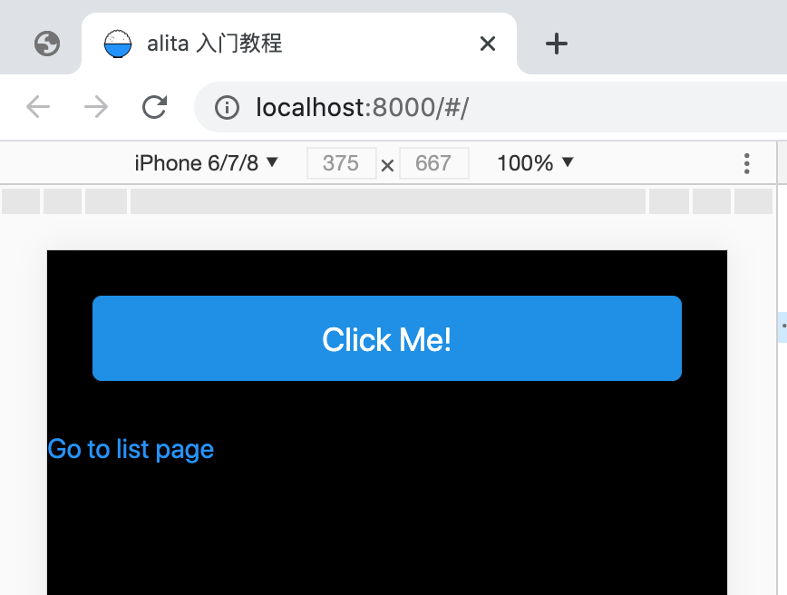

# 资源、元数据和CSS

## 全局样式

`CSS Modules` 对于组件级样式很有用。但是如果你想加载一些 CSS 来作用于**每一页**，alita 也支持这种方式。

要加载全局 CSS 文件，在 `src` 下**创建一个名为`global.css`的文件**，加上以下内容：

```css
body {
  background: black;
}
```

### 重新启动开发服务器

**重要信息:** 添加 `src/global.css` 时，你需要重新启动开发服务器。按 <kbd>Ctrl + c</kbd> 来停止服务器并重新运行:

```shell
npm run start
```

因为 `src/global.css` 是一个约定的文件，如果存在此文件，会被自动引入到入口文件的最全面，当作全局样式。

一开始不存在这个文件，就不会启用这个逻辑，也没有监听这个文件变化，因此新建文件时，需要重启服务。

后续的修改，会有热加载，改动实时预览，无需再次重新启动开发服务。

### 覆盖组件库样式

全局样式还有一个常用的功能，就是覆盖 antd （或者 antd-mobile）的样式。

比如：在首页引入 antd-mobile 组件。

```js
import { Link, Helmet } from 'alita';
import { Button } from 'antd-mobile';

export default () => (
    <div>
        <Helmet>
            <title>alita 入门教程</title>
        </Helmet>
        <Button type="primary">Click Me!</Button>
        <Link to="/list">Go to list page</Link>
    </div>);
```

在 `src/global.css` 中，覆盖样式：

```css
.am-button-primary {
    margin: 50px;
}
```

现在，如果你访问[http://localhost:8000](http://localhost:8000)，你将看到样式生效了：



> **如果它无效**: 请确保在添加 `src/global.css` 时重新启动开发服务器。

>注意：此处的覆盖为全局覆盖，所写样式会影响项目所有的页面，因此建议在项目早期统一编写和修改它。在后期维护中尽量不做编辑操作。所有编辑都要及时的告知其他开发人员。

总结一下到目前为止我们所学到的:

- 要使用 CSS Modules，使用类似 `import styles from './index.css'` 的引入方式，如果某个文件不希望使用 CSS Modules ，可以使用类似 `import './index.css'` 的方式引入。
- 要使用全局样式，请在 [`src/global.css`](/docs/advanced-features/custom-app) 中编写 CSS 文件。
