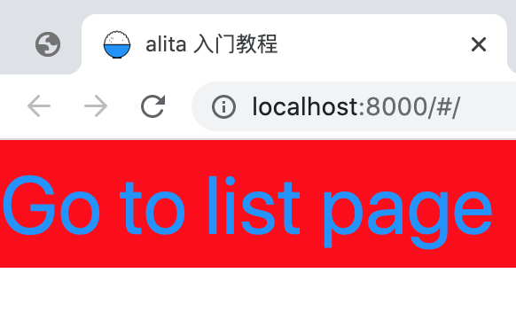
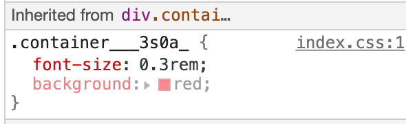

# 资源、元数据和 CSS

## 布局组件

首先，让我们创建一个 **Layout** 组件，这将在所有页面中都是通用的。

- 创建一个名为 `layouts` 的顶级目录。
- 在内部创建一个名为 `index.js` 的文件，其内容如下:

```jsx
function Layout({ children }) {
  return <div>{children}</div>;
}

export default Layout;
```

### 添加 CSS

现在，让我们为 `Layout` 添加一些样式。为此，我们将使用 [CSS Modules](https://github.com/css-modules/css-modules)，它允许你在 React 组件中导入 CSS 文件。

在 `layouts` 目录中创建一个名为 `index.css` 的文件，其内容如下：

```css
.container {
  font-size: 30px;
  background: red;
}
```

> **重要信息:** 要使用 [CSS Modules](/docs/basic-features/built-in-css-support#adding-component-level-css)，CSS 文件名必须以 `.module.css` 结尾。

要在 `Layout` 中使用它，你需要：

- 将其导入为 `styles`
- 使用 `styles.<class-name>` 作为 `className`
- 在这种情况下，类名是 `container`，所以我们将使用 `styles.container`

```jsx
import styles from './index.css';

export default function Layout({ children }) {
  return <div className={styles.container}>{children}</div>;
}
```

如果你现在访问 [http://localhost:8000](http://localhost:8000)，你应该看到文本现在位于一个红色的容器中:



### 自动生成唯一类名

现在，如果你在浏览器开发者工具中查看一下 HTML ，你会注意到 `div` 标记有一个类似 `.container___3s0a_` 的类名。



这就是 `CSS Modules` 所做的：_它自动生成唯一的类名_。只要使用 CSS Modules，你就不必担心类名冲突。

值得注意的是，你在代码中写的 `font-size:30px`，在真实的效果中自动被转换成了 `font-size:0.3rem`。
这是因为，当你在 `config` 中配置了 `appType:'h5'`。alita 就会按照 h5 页面的逻辑来处理你的资源。
比如，此时 alita 使用了`高清方案`自动将`px`单位转换成`rem`，已完成移动端的适配。这里我们约定一个屏幕的宽度为 `750px`。
好处就是如果设计是按照这个尺寸输出效果图的，你可以直接在代码中使用设计标注的尺寸，而无需关心屏幕适配问题。

> 注意：如果你的项目不是一个移动端的项目，那么你应该将 appType 修改为其他值，如 `pc` 等。
