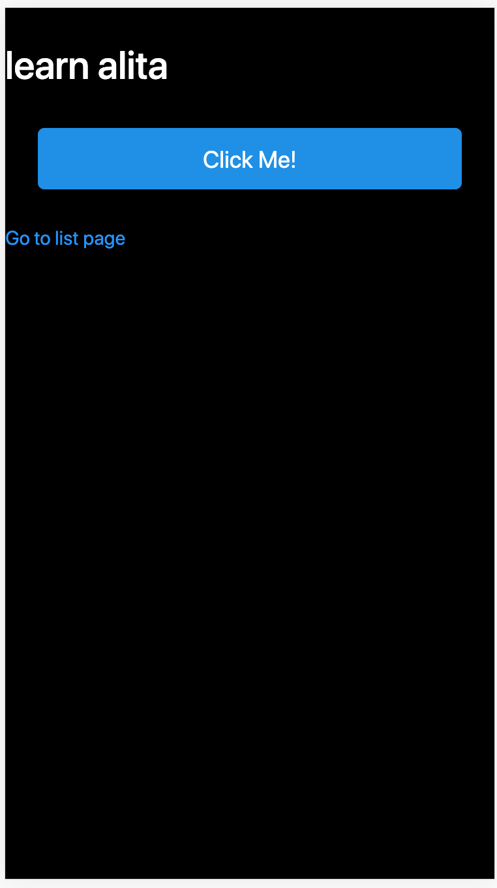
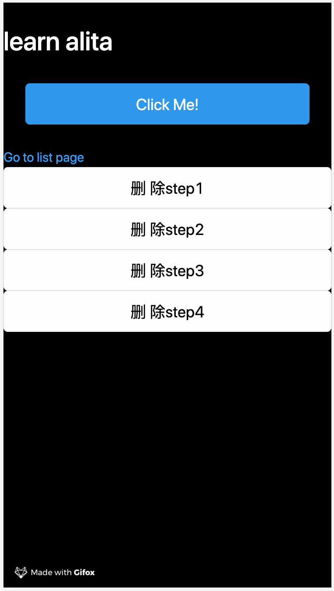

# 数据获取

## dva 课堂实战

首先我们来看一下我们需要完成的需求。

写一个列表，包含删除按钮，点删除按钮后延迟 1 秒执行删除。


> 这里我们只关注 dva 的相关逻辑，页面样式不一定与上述一致。

### 新建 models 文件

在 alita 中，我们约定当 `src/models` 下存在 dva 的 models 文件时，会被自动加载到项目中。
即约定了存在即生效，因此我们约定仅在这个文件夹下存放 dva 的 models 文件，虽然存放其他的文件会被框架自动过滤忽略，但是在这个目录存放其他文件会增加理解的心智负担，建议不要存放无关的文件。且为了管理方便，一般将文件名和 models 的 namespace 一一对应，不仅可以直观的找到相应的 models ，而且能够保证不会存在 models 冲突的问题，因为文件系统本身就不允许同名文件。

新建文件 `src/models/global.js`

```js
const GlobalModel = {
  state: {
    name: 'learn alita',
  },
};

export default GlobalModel;
```

### 在页面绑定 model

这里我们再次复习一下 connect 函数。

```js
import { connect } from 'alita';

connect(映射函数)(组件)
```

```js
// 映射函数

const mapStateToProps = (state)=>state;
```

connect 函数会自动给映射函数传入整个项目的 state，它包含了整个项目的所有的 models。
比如此时我们新建了一个 global 的 models ，那么这时候传入的 state 就是 `{ global }`。

映射函数返回的属性，会被自动传入被绑定的组件，比如我们将上面的映射函数修改为:

```js
// 映射函数

const mapStateToProps = (state)=>{global:state.global};
```

就可以直接从组件的 props 里面取出 global 的属性。这就是 `connect` 函数做的事情。

将上面的代码整理之后，我们就可以得到一下的页面绑定代码，以下的代码，用到了匿名函数还有一些 es6 的缩写方式，如果你不能直观的理解它们，你可以再看看上面的分析过程。这是一个必须要掌握且很容易被忽略的知识。

请注意下方代码中出现三次的 global，我分别在注释中加了少量的说明，增加理解。不明白的，再看一下上述的分析过程。

```js
import { Link, Helmet, connect } from 'alita';
import { Button } from 'antd-mobile';
// 这里的 global 是 connect 向组件中注入的属性
const IndexPage = ({ global }) => {
    const { name } = global;
    return (
        <div>
            <h1 style={{ color: "white" }}>{name}</h1>
            <Helmet>
                <title>alita 入门教程</title>
            </Helmet>
            <Button type="primary">Click Me!</Button>
            <Link to="/list">Go to list page</Link>
        </div>)
};
// 第一个 global 是指从 state 中取出 global model
// 第二个 global 是指返回一个 global 属性，因为是同名所以此处缩写，其实是 { global:global }
export default connect(({ global }) => ({ global }))(IndexPage);
```

### 从 model 取数据

我们可以关注到这个地方，我们从组件的 props 中取出了 global 属性，并从中取出了 name。

```js
const { name } = global;
```

这里的数据结构其实是你在models中定义的数据结构，即：

```js
state: {
  name: 'learn alita',
},
```

比如这里我们定义了这个 model 的 state 是一个对象，所以绑定到页面中时，global就是一个对象，你可以根据自己的真实需要定义这里的数据类型。比如：

```js
// 这里定义了是一个数字类型
state:0

// 因此在 page 中的 global就是一个数字类型，当你再次取 global.name 的时候就会导致程序出错
```

### 预览效果



### 编写页面事件

你可以简化的理解这一个过程，数据绑定是通过单项传递的方式绑定到页面中的，数据修改和变更是通过抛出事件的方式来修改的。这一整个数据流就是这么简单。（里面还有很多细节，但是我们先不理会。）

所以我们需要修改当前页面的数据，我们就会调用到另一个非常常用的函数，`dispatch` 。

其实通过 `connect` 函数绑定后的函数，不仅会被传入 model 的属性，还会被传入 `dispatch` 属性，即你可以通过组件的 props 取出 `dispatch`。

```js
const IndexPage = ({ global,dispatch }) => {

  return (<button onClick={()=>{
    dispatch({
      type: 'global/changeName',
      payload: {
        name:'alita 入门教程'
      }
    })
  }}>click me!</button>)
}
```

这里调用 dispatch 通常需要传入两个参数，`type` 和 `payload`。
你可以理解为，这里你发送一个短信，type 就是地址，payload 就是内容。
此处我们用到的 `global/changeName` 也是一个约定式的写法，
`/` 前面的字符串代表了 models 的 namespace。即我们的 models 的文件名。
`/` 后面的字符串代表了 models 的 action，也就是定义好的事件，我们需要在 model 中的 effects 里写明。

```js
  state: {
    name: 'learn alita',
  },
  effects: {
    *changeName({ payload }, { call, put }) {
      console.log(payload);
      // {name: "alita 入门教程"}
    },
  },
```

到这里，`dispatch` 的工作就完成了。它只关心从页面上触发了一个什么事件，需要把什么内容发送给谁。
至于后续这个数据会有什么作用，会产生什么副作用，它都不再关心。

### 副作用与更新数据

这时候数据就有页面交接到了model，我们在 effects 中处理这些副作用，我这里所谓的副作用包括页面的变化和数据的变化。
比如我们可以在这里请求服务端的接口，也可以直接在此处修改数据。最终我们将处理后的数据，返回到 reducers 事件中。

在 alita 中，我们建议只写一个 reducers 事件 save， 即

```js
reducers: {
    save(state, action) {
      return {
        ...state,
        ...action.payload,
      };
    },
  },
```

你可以直接将它当作 model 里的 setState 使用。

用法如下：

```js

const GlobalModel = {
  namespace: 'global',

  state: {
    name: 'learn alita',
  },
  effects: {
    *changeName({ payload }, { call, put }) {
      console.log(payload);
      yield put({
        type: 'save',
        payload: { name: payload.name },
      });
    },
  },
  reducers: {
    save(state, action) {
      return {
        ...state,
        ...action.payload,
      };
    },
  },
};

export default GlobalModel;

```

effects 中的 put 函数，作用和 `dispatch` 类似，不过它是表示向 reducers 抛出一个事件。
这里接受的 type 和 paylaod 与 `dispatch` 相同，不过在同一个 model 内部，type 可以省略 `/` 之前的 namespace。

保存代码，查看 `http://localhost:8000/#/`，这时候当你点击 “Click Me!” 按钮时，页面上的文字，将从 “learn alita” 变为 “alita 入门教程”。

我们回过头来看 effects ，每个 effects 定义时都有一个 `*` 标志，这表示它是一个 Generator 函数。如果你不太懂得什么是 Generator 函数，那你只需要记住，在编写 effects 时，不要遗漏这个符号即可。

然后它在函数内部的每一个步骤都使用 `yield` 来定义，你可以使用 `async/await` 的概念来做类比，帮助理解。但其实此处更加简单，当你调用函数之外的函数时，你就使用 `yield` 做一个标记，而无需理会这个调用函数的同步还是异步。

effects 函数的第二参数中除了 `put` ，常用的还有 `call` 和 `select` 即： `{ call, put, select }`

call 就是调用其他函数，这个比较好理解。select 的作用是查找 state，比如如果你想获得最新的 global 的state。
可以这么写：`const globalState = yield select(_=>_.global);`

如果你理解了上面的概念，那现在回到我们的问题上：写一个列表，包含删除按钮，点删除按钮后延迟 1 秒执行删除。
对于现在的你是不是有了一点概念了。

- step1:先在 state 中增加一个数组数据 `list:['step1','step2','step3','step4']`
- step2:将数据渲染到页面中
- step3:点击删除按钮，向 effects 发送一个事件
- step4:调用睡眠函数，等待一秒钟
- step5:查询先有 global state 并删除我们点击的对象对应的数据
- step6:将修改后的数据同步到 gloabl state 中（会自动触发页面数据同步）

### demo 演示

```js
// src/models/global

const GlobalModel = {
  namespace: 'global',

  state: {
    name: 'learn alita',
    list: ['step1','step2','step3','step4']
  },
  effects: {
    *changeName({ payload }, { call, put }) {
      yield put({
        type: 'save',
        payload: { name: payload.name },
      });
    },
    *deleteItem({ payload }, { call, put,select }) {
        const { list } = yield select(_=>_.global);
        yield call(()=>new Promise(resolve => {
            setTimeout(resolve, 1000);
          }))
        list.splice(list.findIndex(e => e === payload), 1)
        yield put({
          type: 'save',
          payload: { list },
        });
      },
  },
  reducers: {
    save(state, action) {
      return {
        ...state,
        ...action.payload,
      };
    },
  },
};

export default GlobalModel;
```

```js
// src/pages/index
import { Link, Helmet, connect } from 'alita';
import { Button } from 'antd-mobile';

const IndexPage = ({ global, dispatch }) => {
    const { name, list = [] } = global;
    return (
        <div>
            <h1 style={{ color: "white" }}>{name}</h1>
            <Helmet>
                <title>alita 入门教程</title>
            </Helmet>
            <Button type="primary" onClick={() => {
                dispatch({
                    type: 'global/changeName',
                    payload: {
                        name: 'alita 入门教程'
                    }
                })
            }}>Click Me!</Button>
            <Link to="/list">Go to list page</Link>
            <ul>{list.map(i => (<li key={i}><Button onClick={() => {
                dispatch({
                    type: 'global/deleteItem',
                    payload: i
                })
            }}>删除{i} </Button></li>))}</ul>
        </div>)
};
export default connect(({ global }) => ({ global }))(IndexPage);
```

按照本教程的预期，你应该能够清晰的理解以上的代码片段，如果你在阅读上存在任何的疑问，你可以反复的阅读，直到你真正掌握为止。



### 总结

当你理解了 dva 你会觉得在项目中使用它会很清晰和舒服，但是我们现在不推荐在项目中重度的使用它。因为页面的私有数据流如果暴露到全局的数据流当中，反而会增加页面的维护难度。我们会在下一节课《纯 hooks 的数据流》中，介绍如何在页面中维护页面私有的数据。
