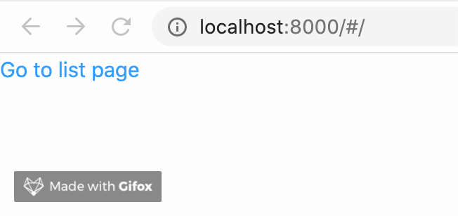

# 页面间导航

## 声明式（Link 组件）

在网站的页面之间链接时，你通常使用 `<a>` HTML 标签。

在 alita 中，你使用了从 `alita` 导出的 `<Link>` 组件对应用程序中的不同页面进行客户端导航。

### 使用 `<Link>`

首先，在 `pages/index.js` 中，从 `alita` 导入 `Link` 组件，方法是在顶部添加这一行:

```js
import { Link } from 'alita'
```

然后修改 `div`  标记中的这一行:

```jsx
Hello Work
```

修改为:

```jsx
<Link to="/list">Go to list page</Link>
```

## 命令式（history）

上述内容，我们在首页使用声明式的方法添加了一个跳转到 `list` 页面的方法，接下来我们通过命令式的方式，从 `list` 返回首页。

接下来，将 `pages/list/index.js` 的内容改为:

```jsx
export default function List({ history }) {
    return (
        <div>
            <h1>list</h1>
            <button onClick={() => history.goBack()}>go back!</button>
            <button onClick={() => history.push('/')} >go to index!</button>
        </div>
    )
}
```

我们添加了两个按钮，一个使用了**回退**方法，另一个使用了跳转方法。

虽然从效果是来看都是从列表页跳转到了主页，但需要注意的是，使用 goBack 方法，会撤回一次浏览器历史。也就是说，你无法使用浏览器上面的后退按钮（包括安卓设备上的返回键），返回list页面。而使用 push 返回，会增加一个浏览器历史。如果多次在两个页面之间 push ，会导致使用回退按钮返回页面时，会有一个很长的浏览器历史列表。

goBack 方法完全依赖于项目的浏览历史，也就是说完全依赖于你的“前一个页面”。这意味着，当你在当前路由刷新页面时， goBack 有可能会失效。所以实际项目中，要根据具体的项目逻辑和场景来选择合适的方法。当然你也可以是使用诸如重定向这样的方法，详细内容，可以查看[history](https://github.com/ReactTraining/history/blob/master/docs/api-reference.md#navigation)。

让我们来看看它的运行效果。你现在应该在每一页上都有一个链接，允许你来回切换页面:



[完整源码](https://github.com/alitajs/learn-alita-demo/tree/step4-navigate-between-pages-link-component)
