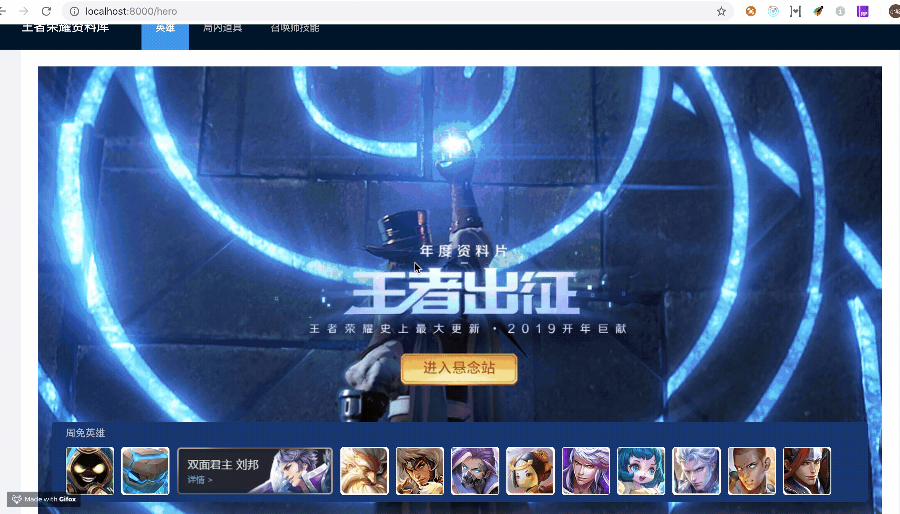

# 完成英雄页 banner



这是一篇纯写样式的代码，旨在让你再次熟悉数据流和页面渲染。如果你能够独立完成上面的效果，那你就不用继续阅读这篇文章了。

### 1.添加 mock 数据

`./mock/api.ts`

```javascript
import { Request, Response } from 'express';
import herolist from './heros';

export default {
  'POST /api/freeheros.json': (req: Request, res: Response) => {
    const { number } = req.body;
    function getRandomArrayElements(arr, count) {
      const shuffled = arr.slice(0);
      let i = arr.length;
      const min = i - count;
      let temp;
      let index;
      // eslint-disable-next-line no-plusplus
      while (i-- > min) {
        index = Math.floor((i + 1) * Math.random());
        temp = shuffled[index];
        shuffled[index] = shuffled[i];
        shuffled[i] = temp;
      }
      return shuffled.slice(min);
    }
    const freeheros = getRandomArrayElements(herolist, number);
    res.send(freeheros);
  },
};
```

这里我们增加了周免英雄的接口，从英雄池里面随机取出了几个对象，这个方法是我找来的，旨在做一个简单的演示，不要太在意，如果你有更好的方法，完全可以用你自己的。

### 2.增加请求服务

`./src/pages/hero/service.js`

```javascript
export async function queryFreeHeros(params: any): Promise<any> {
  return request('/api/freeheros.json', {
    method: 'POST',
    body: JSON.stringify(params),
  });
}
```

### 3.在页面中请求数据

`./src/pages/hero/index.tsx`

```diff
- import { query } from './service';
+ import { query, queryFreeHeros } from './service';

...

  const { data: freeHeros = [] } = useRequest(queryFreeHeros);

```

### 4.编写 FreeHeroItem 组件

`./src/components/FreeHeroItem.tsx`

```jsx
import React from 'react';
interface FreeHeroItemProps {
  data: any;
  thisIndex: number;
  onItemHover: Function;
  itemHover: number;
}
const FreeHeroItem: React.FC<FreeHeroItemProps> = ({
  data,
  thisIndex,
  onItemHover,
  itemHover,
}) => {
  if (!data || !data.ename) return null;
  return (
     {
        itemHover !== thisIndex && onItemHover(thisIndex);
      }}
      style={{
        borderRadius: '5px',
        height: '69px',
        margin: '5px',
        width: itemHover === thisIndex ? '224px' : '69px',
      }}
      src={`https://game.gtimg.cn/images/yxzj/img201606/heroimg/${data.ename}/${
        data.ename
      }${itemHover === thisIndex ? '-freehover.png' : '.jpg'}`}
    />
  );
};
export default FreeHeroItem;
```

因为这个组件的样式很少，所以我们把样式写在 style 中，这样可以减少一个 less 文件。

### 5.在页面中渲染数据

`./src/pages/hero/index.tsx`

```js
import FreeHeroItem from '@/components/FreeHeroItem';
...
return (
  <div className={styles.normal}>
    <div className={styles.info}>
      <Row className={styles.freehero}>
        <Col span={24}>
          <p>周免英雄</p>
          <div>
            {freeheros.map((data,index) => {
              return <FreeHeroItem data={data} itemHover={itemHover} onItemHover={onItemHover} thisIndex={index} key={index}/>
            })}
          </div>
        </Col>
      </Row>
    </div>
    ... ...
  </div>
)
```

### 6.为页面添加样式

`./src/pages/hero/index.less`

```less
.center {
  background: url(//game.gtimg.cn/images/yxzj/web201605/top_banner/bg_wrapper2.jpg)
    no-repeat center top;
  padding-top: 500px;

  .info {
    padding: 8px 20px 0;
    margin-bottom: 20px;

    .freehero {
      overflow: hidden;
      width: 100%;
      border-radius: 5px;
      height: 115px;
      padding: 0 15px;
      background-color: #123564;

      p {
        color: #a6afbc;
        margin: 5px;
      }
    }
  }

  .heroitem {
    text-align: center;
    color: #363636;

    img {
      width: 83px;
      height: 83px;
      border: 2px solid #258df2;
      border-radius: 0 10px 0 10px;
    }
  }
}
```

### 7.为页面增加响应事件

`./src/components/FreeHeroItem.tsx`

```diff
// 详细代码见步骤4
+ onMouseEnter={() => {
+    itemHover !== thisIndex && onItemHover(thisIndex);
+ }}
```

`./src/pages/hero/index.tsx`

```diff
+  const [itemHover, setItemHover] = useState(0);

return (
...
  <FreeHeroItem data={data} itemHover={itemHover} onItemHover={onItemHover}
//这里面的详细代码见步骤5
)
```
