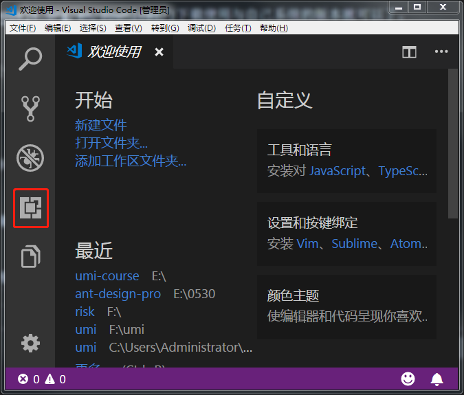
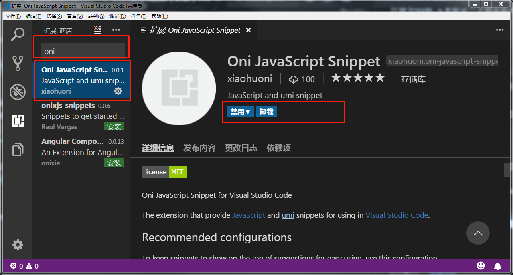
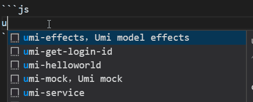
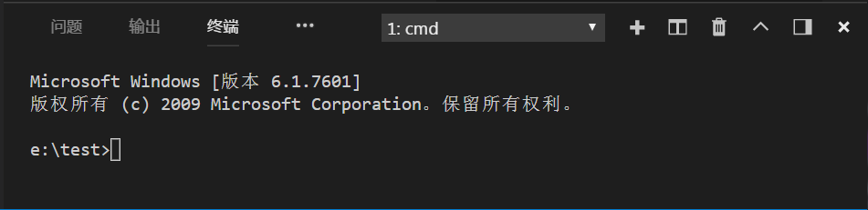

# 开发环境搭建

Alita 在 Windows, Mac 和 Linux 的表现都是一致的。你只需要在电脑上安装 Node.js 环境。

为了便于开发，你需要使用 VisualStudio Code。因为后续我们会使用配套的 VisualStudio Code 插件来提升开发效率，并且它还自带了一个命令行执行脚本。

## 第一步 安装 Node.js

安装 [Node](https://nodejs.org/en/download/) 还是挺简单的，只需要到官网下载使用与自己系统的版本就可以了。

所有的安装都是“下一步”，就可以了。

如果你已经安装过 Node，那么你可以跳过前一步。

接下来在终端/控制台窗口中运行命令 `node -v`，来验证一下你正在运行 `node 8.1x` 以上的版本。

```bash
>node -v
v8.10.1
```

如果终端成功打印出 `node` 的版本号，就可以进入下一步了。

## 第二步 安装 VisualStudio Code

还是[官网](https://code.visualstudio.com/)下载,全部下一步。

## 第三步 安装 VisualStudio Code 插件

安装完 VS Code 之后，打开 VS Code，在最左侧功能按钮中选中，扩展。



在搜索中，查找 “Oni”，选择 Oni JavaScript Snippet，安装



使用方法：



这个插件集成了很多 umi 的代码段，如果你发现有任何遗漏的，可以在[ISSUES](https://github.com/xiaohuoni/snippet/issues)中讨论。

## 第四步 在 VS Code 中使用命令行

打开 VS Code，使用快捷键 `Ctrl + ·`，(键盘 `Esc` 下面，`数字1` 左边的键)，如果你的电脑上存在热键冲突，无法正确打开。那你可以在你的项目目录区域，点击右键，在命令提示符中打开。

打开 VS Code，使用快捷键 `Ctrl + ·`，(键盘 Esc 下面，数字 1 左边的键)，如果你的电脑上存在热键冲突，无法正确打开。那你可以在你的项目目录区域，点击右键，在命令提示符中打开。



具体的使用我们会在后面的章节中提到。

## 附录：VSCode 推荐安装插件

```text
Debugger for Chrome
Git History
MDTools
npm
React Native Tools
vscode-icons
vscode-styled-jsx
Settings Sync
Babel JavaScript
ESLint
GitLens — Git supercharged
LintLens — ESLint rules made easier
DotENV
Guides
Bracket Pair Colorizer
ES7 React/Redux/GraphQL/React-Native snippets
Color Highlight
gitignore
TODO Highlight
Sort JSON objects
EditorConfig for VS Code
Image preview
Markdown All in One
Markdown Preview Github Styling
HTML CSS Support
Sort lines
Version Lens
Visual Studio IntelliCode - Preview
```
