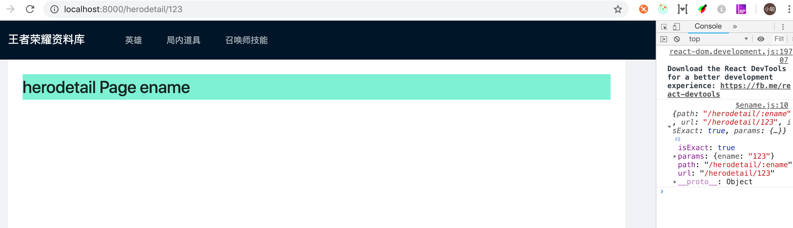

# 动态路由

## 新建道具详情页面

### 1、使用 g pages 新建页面

```bash
$ alita g pages itemdetail

Write: src/pages/itemdetail/index.tsx
Write: src/pages/itemdetail/index.less
Write: src/pages/itemdetail/service.ts
```

### 2、重命名 herodetail/index.tsx

`./src/pages/itemdetail/index.tsx` => `./src/pages/itemdetail/[index].tsx`。

框架中约定，带 `[]` 的目录或文件为动态路由。

## 在页面中取得动态路由传参

```diff
- const ItemdetailPage: FC<PageProps> = () => {
+ const ItemdetailPage: FC<PageProps> = ({ match }) => {
+   console.log(match);
    ...
  }
```

动态路由的参数通过 `match`，这里打印的值，如上述标注。相当于 this.props.match。
访问http://localhost:8000/#/itemdetail/1726



## 动态路由的使用

我们并不推荐使用动态路由来传递参数，因此在 alita 中限制来动态路由的能力，你只能使用一个参数来传递你的数据。
其他的共享数据建议你通过请求服务端，或者通过全局数据共享。
