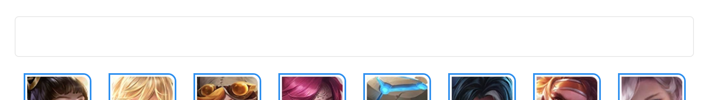
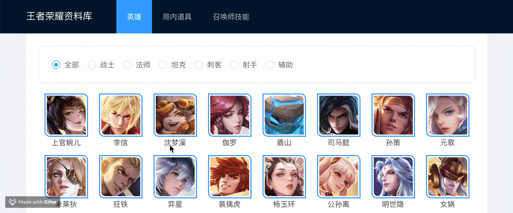
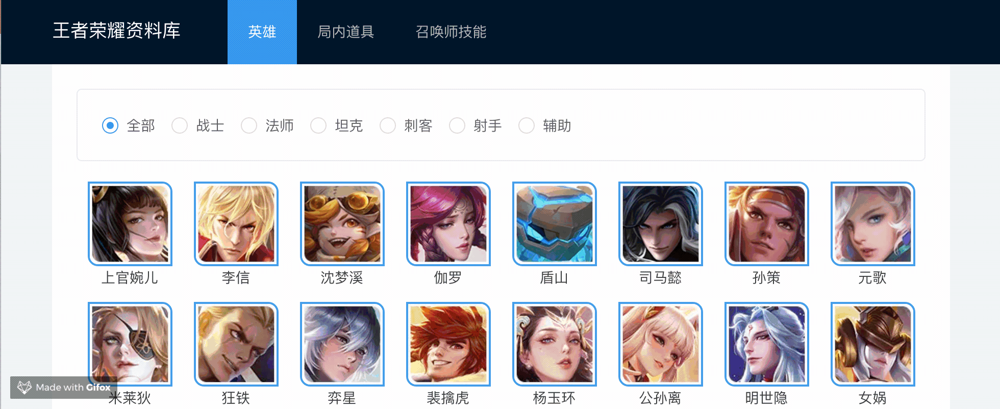

# 增加过滤条件


这小节，我们会简单的使用 antd 的 Card 和 Radio，还是一样的，你可以自己先尝试着，实现，如果你可以独立完成，那你就不需要阅读本节了。

## 实现步骤

### step1 分析数据，获得过滤条件

通过分析 herolist 的数据，我们得出 herotype 的对应表

```javascript
const heroType = [
  { key: 0, value: '全部' },
  { key: 1, value: '战士' },
  { key: 2, value: '法师' },
  { key: 3, value: '坦克' },
  { key: 4, value: '刺客' },
  { key: 5, value: '射手' },
  { key: 6, value: '辅助' },
];
```

### step2 添加 Card 布局

```diff
- import { Row, Col } from 'antd';
+ import { Row, Col, Card } from 'antd';
...
<div className={styles.normal}>
+  <Card className={styles.radioPanel}>
+  </Card>
...
```



### step3 增加单选框分组

```diff
- import { Row, Col, Card } from 'antd';
+ import { Row, Col, Radio, Card } from 'antd';
+ const RadioGroup = Radio.Group;
+ const heroType = [
+  { key: 0, value: '全部' },
+  { key: 1, value: '战士' },
+  { key: 2, value: '法师' },
+  { key: 3, value: '坦克' },
+  { key: 4, value: '刺客' },
+  { key: 5, value: '射手' },
+  { key: 6, value: '辅助' },
+ ];
...
<Card className={styles.radioPanel}>
+  <RadioGroup>
+   {heroType.map(data => (
+     <Radio value={data.key} key={`hero-rodio-${data.key}`}>
+       {data.value}
+     </Radio>
+   ))}
+  </RadioGroup>
</Card>
```

### step4 为单选框分组增加事件和值

```diff
- import React, { FC } from 'react';
+ import React, { FC, useState } from 'react';
+ const [filterKey, setFilterKey] = useState(0);

...
- <RadioGroup>
+ <RadioGroup onChange={(e)=>console.log(e)} value={filterKey}>
```

### step5 将事件同步到 state 中

```diff
- <RadioGroup onChange={(e)=>console.log(e)} value={filterKey}>
+ <RadioGroup onChange={(e) => setFilterKey(e.target.value)} value={filterKey}>
```

### step6 使用 filterKey 过滤数组

```diff
<Row>
- {heros.reverse().map(item => (
+ {heros.filter((item: any)=>filterKey===0||item.hero_type === filterKey).reverse().map((item: any) => (
...
</Row>
```

第一个条件 `filterKey===0` 是因为我们把全部的 key 设置为 0

第二个条件判断 `hero_type`,过滤数组。

### step7 保存，运行程序



## 练习

参考上述操作，为局内道具页面 [http://localhost:8000/item](http://localhost:8000/item)增加过滤条件。

提示

```javascript
const itemType = [
  { key: 0, value: '全部' },
  { key: 1, value: '攻击' },
  { key: 2, value: '法术' },
  { key: 3, value: '防御' },
  { key: 4, value: '移动' },
  { key: 5, value: '打野' },
  { key: 7, value: '辅助' },
];
```


