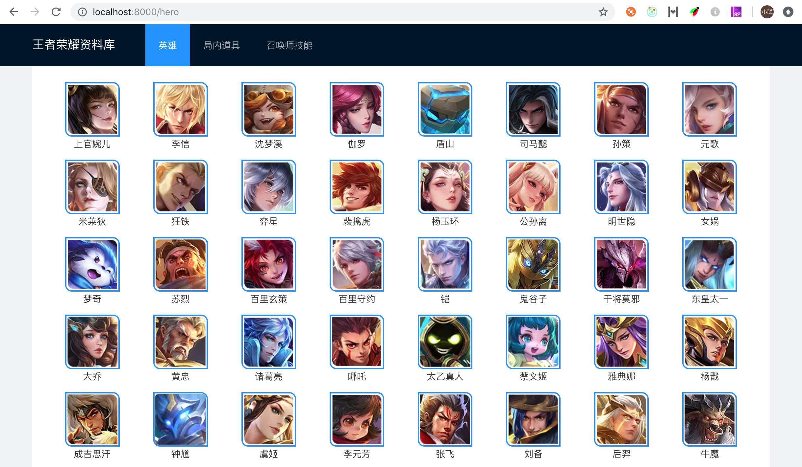
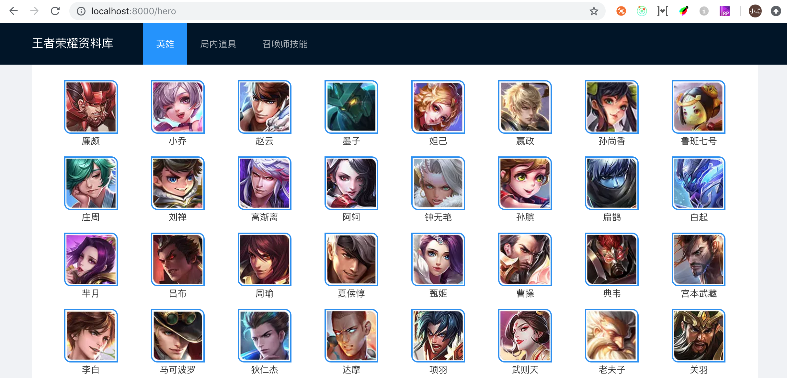

# 美化英雄列表



## 在框架中使用 less

要在框架中使用 less 不需要任何配置，直接使用就可以了。

分析页面这是一个栅格布局，我们使用 `antd` 的 `Row` 和 `Col` 实现。

这小节的最终效果，如上图所示，你可以自己先尝试着实现，如果你可以完成，那你就不需要再阅读本节内容。

## 实现步骤

### step1 先取出 heros 数据

```javascript
const { data: heros = localData } = useRequest(query);
```

这里使用了 `es6` 的语法，我们先给 data 取了一个别名叫做 heros ，这里又给 `heros` 定了一个默认值，这样我们在 dom 里面就不要判断了。（类似 `heros&&heros` 这样的语句）。

### step2 循环取出 heros，绑定页面

```jsx
import { Row, Col } from 'antd';

<Row>
  {heros.map(item => (
    <Col key={item.ename} span={3}>
      
      <p>{item.cname}</p>
    </Col>
  ))}
</Row>;
```

> 注意：这里的 src 为 https://game.gtimg.cn/images/yxzj/img201606/heroimg/513/513.jpg，其中513为英雄的ename，这是我分析出来的。放上去，可用。后续如果官网有修改，这个图片地址不对的话，要替换为新地址。

### step3 为页面添加样式

```jsx
<Col key={item.ename} span={3} className={styles.heroitem}>
```

`index.less`

```less
.center {
  /* background: #F2B279; */
  .heroitem {
    text-align: center;
    color: #363636;

    img {
      width: 83px;
      height: 83px;
      border: 2px solid #258df2;
      border-radius: 0 10px 0 10px;
    }
  }
}
```

### step4 保存，运行程序



我们发现，页面是我们想要的样式，但是数据反了，所以我们先将数组逆序处理。

```jsx
<Row>
  {heros.reverse().map(item => (
    <Col key={item.ename} span={3} className={styles.heroitem}>
      
      <p>{item.cname}</p>
    </Col>
  ))}
</Row>
```

最终效果为


## 练习

参考上面的写法，实现局内道具页面 [http://localhost:8000/item](http://localhost:8000/item)

提示

```jsx

```
