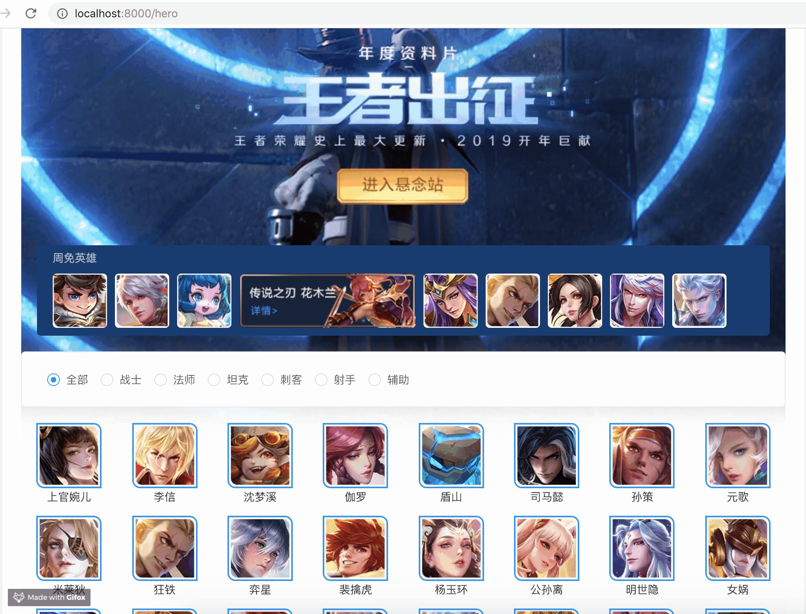

# 简介

**教程:王者荣耀资料库** 涵盖了 Alita 的基本知识。在本教程中，你将构建一个应用，来展示王者荣耀的基本资料，如英雄列表，局内道具，召唤师技能等。

这个入门教程包含了很多 Umi 项目的特性，它需要通过获取并展示王者荣耀的基本数据，并在不同的视图之间导航。

完成本次教程，你将学会：

- 如何初始化 Alita 项目
- 理解 Alita 的目录结构及目录约定
- 学会在不同的页面之间导航
- 初次使用 antd 的布局组件
- 如何绑定数据
- 如何监听路由事件
- 如何发起 http 请求
- 如何使用和设置 proxy 请求代理
- 如何使用 Mock 数据
- 如何使用动态路由
- 等

学到这些知识，那你应该可以使用 Alita，构建你自己的应用了。

完成本教程的所有步骤之后，最终的应用会是这样的：

