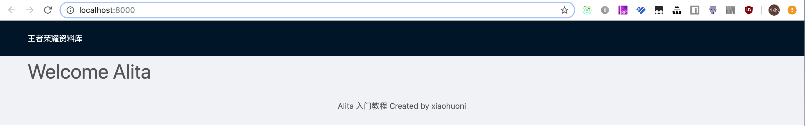
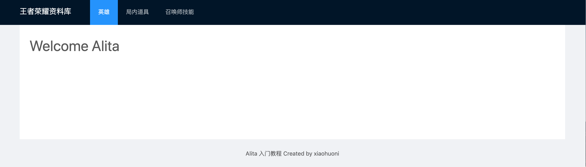

# 全局布局

## 第一步 修改 appType 配置

由于我们这次的 demo 是一个 pc 页面，因此我们先确认一下项目配置的 appType 是否符合我们的预期。
打开 `config/config.ts` 文件，修改或者增加 appType。

```js
export default {
  appType: 'pc',
};
```

## 第二步 新建./src/layouts/index.tsx

教程中，我们暂不使用到现有的代码，所以小伙伴们可以在 `src/layout/index.tsx` 下使用下面的代码。

```javascript
import React from 'react';
import styles from './index.less';

const BasicLayout: React.FC = ({ children }) => {
  return <div>{children}</div>;
};

export default BasicLayout;
```

layout 文件如上。可以看到，其实 `layout` 也是一个组件。框架会自动使用它包裹页面，并传入 `props`。

```js
//props
{
  history: {length: 1, action: "POP", location: {…}, createHref: ƒ, push: ƒ, …}
  location: {pathname: "/", search: "", hash: "", query: {…}, state: undefined}
  match: {path: "/", url: "/", isExact: true, params: {…}}
  route: {path: "/", component: ƒ, routes: Array(2), _title: "hero", _title_default: "hero"}
  staticContext: undefined
}
```

你可以随意的修改这个文件，但是一定要记得包裹 `{ props.children }`。

## 第三步 使用 antd 的 layout

在文件头部引入 `antd` 的 Layout 组件,并从 `Layout` 中取出 `Header`, `Content`, `Footer`。

```javascript
import { Layout } from 'antd';
const { Header, Content, Footer } = Layout;
```

使用 Header, Content, Footer，包裹 children。

```javascript
import React from 'react';
import { Layout, Menu } from 'antd';
import styles from './index.less';

const { Header, Content, Footer } = Layout;

const BasicLayout: React.FC = ({ children }) => (
  <Layout>
    <Header>
      <div style={{ color: 'white' }}>王者荣耀资料库</div>
    </Header>
    <Content style={{ padding: '0 50px' }}>{children}</Content>
    <Footer style={{ textAlign: 'center' }}>
      Alita 入门教程 Created by xiaohuoni
    </Footer>
  </Layout>
);

export default BasicLayout;
```



更改完后的效果，看起来不错吧，你可以随意的改改，看看效果。

## 第四步 增加页面导航

在 `Header` 中增加导航

```diff
<Header>
- <div style={{ color: 'white' }}>王者荣耀资料库</div>
+ <div className={styles.logo}>王者荣耀资料库 </div>
+    <Menu
+      theme="dark"
+      mode="horizontal"
+      defaultSelectedKeys={['1']}
+      style={{ lineHeight: '64px' }}
+    >
+      <Menu.Item key="1">英雄</Menu.Item>
+      <Menu.Item key="2">局内道具</Menu.Item>
+      <Menu.Item key="3">召唤师技能</Menu.Item>
+    </Menu>
</Header>
```

在 `./src/layouts/index.less` 中增加 `logo` 样式

```css
.logo {
  width: 148px;
  color: white;
  margin: 16px 24px 16px 0;
  float: left;
  font-size: 18px;
  line-height: 30px;
}
```

为了使得页面更美观，修改 Content

```jsx
<Content style={{ padding: '0 50px' }}>
  <div style={{ background: '#fff', padding: 24, minHeight: 280 }}>
    {children}
  </div>
</Content>
```

## 最终效果



##
