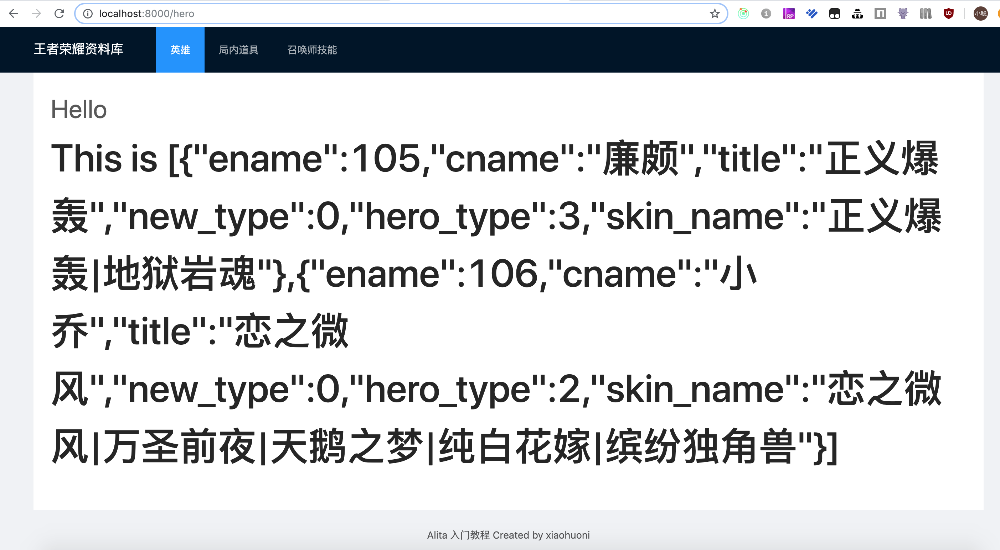

# 监听路由事件

这里有一个很常见的需求，我们需要在进入页面的时候，发起请求页面初始化数据。

这里我们有两种方式来实现(建议使用第一种， demo 中以第一种方式实现)。

## 第一种：使用 react hooks

### 1.在页面中使用 useEffect

#### ./src/page/hero/index.tsx

```javascript
import React, { FC, useEffect, useState } from 'react';
import { query } from './service';
import styles from './index.less';

interface HeroPageProps {}

const HeroPage: FC<HeroPageProps> = () => {
  const [state, setState] = useState('');
  const init = async () => {
    const { data } = await query();
    setState(data.text);
  };
  useEffect(() => {
    init();
  }, []);
  return <div className={styles.center}>Hello {state}</div>;
};

export default HeroPage;
```

上面的代码如果无法理解，请返回阅读[纯 hooks 数据流](/learn/data-fetching/hooks)

### 2.使用 useRequest

```javascript
import React, { FC } from 'react';
import { useRequest } from 'alita';
import { query } from './service';
import styles from './index.less';

interface HeroPageProps {}

const HeroPage: FC<HeroPageProps> = () => {
  const { data } = useRequest(query);
  return <div className={styles.center}>Hello {data?.text}</div>;
};

export default HeroPage;
```

更多关于 useRequest 的用法，请阅读[文档](/guide/use-request)

## 第二种：在 dva 中 使用 subscriptions

此方法使用了 dva,在存在某些全局数据需要维护，并且这些全局数据存在非 DOM 的使用场景时，即无法使用 react hooks 时，我们才建议使用 dva。以下是根据 dva 的方式处理的，本次教程中未要求。你可以尝试着新建和执行下列的步骤，这将有助于你进一步的掌握 dva 。

### ./src/models/hero.ts

```js
import { Effect, Subscription } from 'alita';

export interface HeroModelType {
  ...,
  subscriptions: { setup: Subscription };
}

const HeroModel: HeroModelType = {
  ...,
  subscriptions: {
    setup({ dispatch, history }) {
      return history.listen(({ pathname }) => {
        if (pathname === '/hero') {
          dispatch({
            type: 'fetch',
          });
        }
      });
    },
  },
}
```

这里需要注意的是，subscriptions 是一个全局的监听，就是说，当设定触发条件满足时，所有的 subscriptions 都会响应，所以我们在这里判断了路由为当前路由时，发起一个 effects 事件。

### ./src/models/hero.ts

然后在 `effects` 里面，响应这个事件。

```javascript
export interface HeroModelType {
  namespace: 'hero';
  state: HeroModelState;
  effects: {
-    query: Effect;
+    fetch: Effect;
  };
  reducers: {
    save: Reducer<HeroModelState>;
  };
}

effects: {
  *fetch({ payload }, { put, call, select }) {
    const data = [
      {
        ename: 105,
        cname: '廉颇',
        title: '正义爆轰',
        new_type: 0,
        hero_type: 3,
        skin_name: '正义爆轰|地狱岩魂',
      },
      {
        ename: 106,
        cname: '小乔',
        title: '恋之微风',
        new_type: 0,
        hero_type: 2,
        skin_name: '恋之微风|万圣前夜|天鹅之梦|纯白花嫁|缤纷独角兽',
      },
    ];
    yield put({
      type: 'save',
      payload: {
        heros: data,
      },
    });
  },
},
```

这里的 `*fetch` 前面的 `*` 表示它是一个异步函数，你可以在里面使用 `yield` 进行等待操作。

这里的 `put` 方法和 `dispatch` 方法可以理解为同一个方法，只是在不同的地方，用不同的方法名表示而已。

这里我们写了一个静态数据，然后又发起了一个叫做 `save` 的事件。

### ./src/models/hero.js reducers

最终我们在 `reducers` 中响应了这个 `save` 事件，用于更新页面数据，触发页面更新。

```javascript
reducers: {
    save(state, action) {
      return { ...state, ...action.payload };
    },
  },
```

这里我们定义了一个比较通用的方法，在 `effects` 发起需要更新数据时，全部发起 `save` 事件。然后在 `save` 中只是简单的把 `payload` 解构出来，部分覆盖了页面的 `state`。

当然我们这次的 `effects-fetch` 里发起了更新一个叫做 `heros` 的对象，但是我们的页面 `state` 中没有。

```javascript
state: 'hero';
```

所以我们还要修改我们页面的 state

```diff
export interface HeroModelState {
  name: string;
+ heros: [];
} // 非typescript项目，可以忽略类型文件相关操作
...
  state: {
    name: '',
+   heros: [],
  },
```

修改完，保存。

### 在页面中使用数据

因为我们的页面和 `model` 是绑定的，所以可以从页面的 `props` 里面，取出 `hero` 对象，在里面取出我们定义的数据。

```diff
const HeroPage: FC<PageProps> = ({ hero, dispatch }) => {
-  const { name } = hero;
+  const { heros } = hero;

return (
  <div className={styles.center}>
+   <h2>This is {JSON.stringify(heros)}</h2>
  </div>
);
}
```

页面和数据绑定的对象，可以查看页面类前面的 `connect`，以下表示这个页面和 `namespace` 为 `hero`的 `model` 绑定，注意这里可以绑定多个 `model`，只要你需要取值的对象，你都可以绑定在页面上。

```js
export default connect(({ hero }: { hero: HeroModelState }) => ({ hero }))(
  HeroPage,
);
```



这样我们就实现了，监听路由事件取得静态数据，修改页面 `state`，触发页面重绘。
