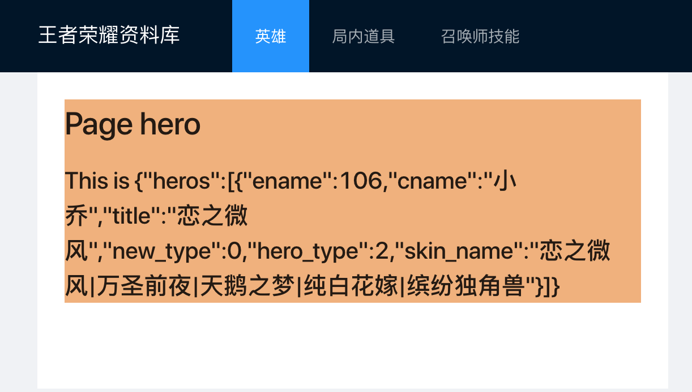
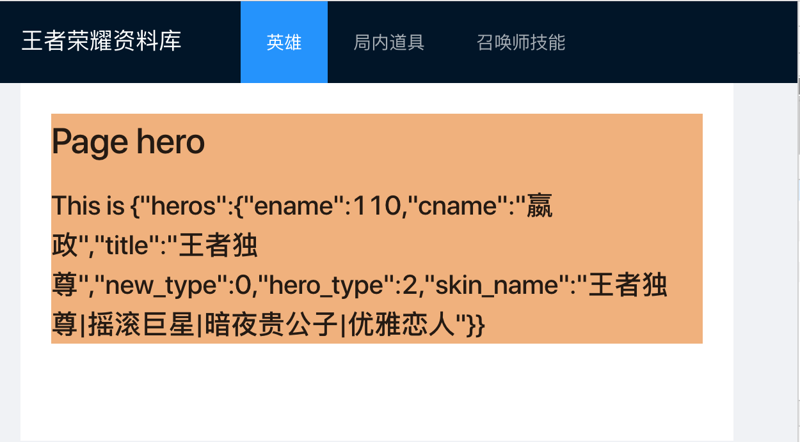

# Mock 数据

## 预想的问题

- 在实际项目开发中，我们经常会遇到和服务端同步开发的情况。
  这时候我们就可以要求服务端先输出接口文档，前后端都根据接口文档输出。
  在项目交付之前一段时间，再进行前后端连调。
- 在 demo 开发学习的过程中，我们也常常遇到需要静态数据的情况
- 公司网络限制了只能访问部分外网，是的，墙里墙，还是满多的
- 没有网络的情况，呵呵，想到咖啡店敲个代码，悠哉悠哉，没有公用 Wi-Fi，接口都挂了，页面渲染不出来

## 框架中使用 mock

在框架中使用 `mock` 还是蛮简单的，任何配置都不需要，只要在 `./mock/` 文件夹下，新建 `ts` 文件，然后按照规范编写文档，就可以使用 `mock` 功能了。

## ./mock/heros.ts

```javascript
export default {
  '/api/herolist.json': [
    {
      ename: 106,
      cname: '小乔',
      title: '恋之微风',
      new_type: 0,
      hero_type: 2,
      skin_name: '恋之微风|万圣前夜|天鹅之梦|纯白花嫁|缤纷独角兽',
    },
  ],
};
```

只要请求路径匹配，那么就会直接返回数组。

我们先关闭 `config/config.ts` 中的 proxy 配置,先注释掉就好。

```javascript
// proxy: {
//   "/api": {
//     "target": "https://pvp.qq.com/web201605/js/",
//     "changeOrigin": true,
//     "pathRewrite": { "^/api" : "" }
//   }
// }
```

我们先关闭 `config/config.ts` 中的 `proxy` 配置,先注释掉就好。

然后开启开发服务器



> 我们写在 model 里面的静态文件是有两个英雄的，使用 proxy 代理，从官方取得是有几十个英雄的，从 mock 里面取的是一个英雄的数据。

## 保存接口数据

我们把 `https://pvp.qq.com/web201605/js/herolist.json` 请求的数据，保存下来，作为我们的本地数据，存放到 `./mock/herolist.json` 其实你可以放到任意的地方，放在这里面也不会被解析成 mock 服务，只是就近放在一起而已，因为这个数据很大，放到 `./mock/heros.ts` 里面的话会让文件变得很长，不利于我们看代码。

然后在 `./mock/heros.ts` 中引入 herolist.json ,修改一下请求的返回值，这样我们的 mock 数据就和官方接口返回值保持一致啦。

```javascript
import herolist from './herolist.json';
export default {
  '/api/herolist.json': herolist,
};
```

> 在开发过程中，服务端启用临时服务器，返回出参，可以通过这种不规范不推荐的方式保留下来。在服务器不可以的情况下，我们还可以进行前端的开发工作
> 还有一种比较常用的方式是需要取得请求携带的参数

## mock 请求携带参数

比如我们需要取得单个英雄的数据，我们就需要在请求里面携带参数。

`./mock/heros.ts`

```javascript
'POST /api/herodetails.json': (req, res) => {
  const { ename } = req.body;
  const hero = herolist.filter(item => item.ename === parseInt(ename, 10))[0];
  res.send(hero);
},
```

定义了这个请求是 `post` 请求，并从请求参数中取出来 `ename` 对原数组做了过滤。

然后在 `./src/pages/hero/service.ts` 中修改请求。

```javascript
const data = yield request('/api/herodetails.json', {
  method: 'POST',
  body: {
    ename: 110,
  },
});
```

请求携带了参数 body，但是，到后端取不到数据。

## mock post 取不到参数

这里需要注意，我们需要为请求增加请求头，还有 body，需要转成字符串。

`src/app.ts`

```js
export const request = {
  prefix: '',
  headers: {
    Accept: 'application/json',
    'Content-Type': 'application/json; charset=utf-8',
  },
  errorHandler: error => {
    // 集中处理错误
    console.log(error);
  },
};
```

最后我们发起的请求就是

```javascript
const data = yield request('/api/herodetails.json', {
  method: 'POST',
  body: JSON.stringify({
    ename: 110,
  }),
});

```



这两种写法是比较简单常用的，更多的 mock 推荐用法，可以查阅 umi 官网，[mock-data](https://umijs.org/docs/mock)
