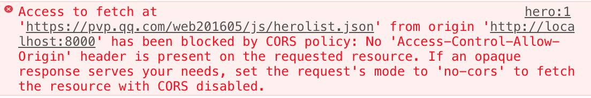
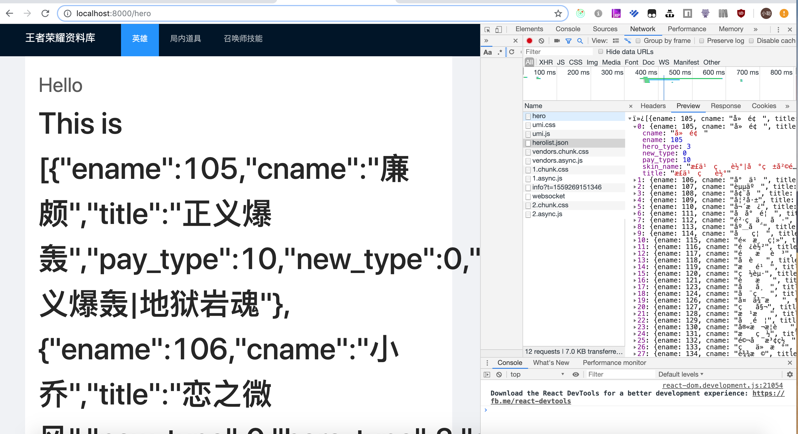
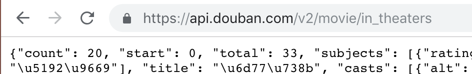

# proxy 请求代理



上一小节中，我们还存在一个问题未处理，就是跨域访问问题。

框架提供了 proxy 来处理这个问题，详细的 proxy 技术可以查阅其他资料，这里我只做简要说明。

之所以会出现跨域访问问题，是因为浏览器的安全策略。

所以我们预想是不是有一种方式，能够绕过浏览器的安全策略？

那就是先请求一个同源服务器，再由服务器去请求，其他的服务器。

比如，我们本来是要请求 `https://pvp.qq.com` 服务器，但是它存在跨域。

所以我们先请求了 `http://localhost:3000` (假设的)，它不存在跨域问题，所以它受理了我们的请求，并且我们可以取得它返回的数据。

而它返回的这个数据，又是从真实的 `https://pvp.qq.com` 获取来的，因为服务端不是在浏览器环境，所以就没有浏览器的安全策略问题。

因为 `http://localhost:3000` (假设的)这个服务器，它只是把我们请求的参数，转发到真实服务端，又把真实服务端下发的数据，转发给我们，所以我们称它为代理。

## 配置 proxy

要在框架中使用 `proxy` 非常简单，只要在配置文件中配置就可以了。

`config/config.ts`

> 如果你没有这个文件，新建一个即可。

```javascript
export default {
  appType: 'pc',
  proxy: {
    "/api": {                                       ---step1
      "target": "https://pvp.qq.com/web201605/js/", ---step2
      "changeOrigin": true,                         ---step3
      "pathRewrite": { "^/api" : "" }               ---step4
    }
  }
}
```

- step1 设置了需要代理的请求头，比如这里定义了 `/api` ，当你访问如 `/api/abc` 这样子的请求，就会触发代理
- step2 设置代理的目标，即真实的服务器地址
- changeOrigin 设置是否跨域请求资源
- pathRewrite 表示是否重写请求地址，比如这里的配置，就是把 `/api` 替换成空字符

## ./src/pages/hero/service.ts

```diff
- return request('https://pvp.qq.com/web201605/js/herolist.json', { method: 'get' });;
+ return request('/api/herolist.json', { method: 'get' });;
```

修改请求地址，前缀改成 `/api` ，其实通过代理，最后真实访问的地址还是 `https://pvp.qq.com/web201605/js/herolist.json`

这时候我们就取到了网络上的数据了。

## 使用 useRequest 时的强制约定

这里我们可以看到，我们正确请求了数据，并且数据也正确放回了，但是在页面中，我们并没有正确的获取到真
实的数据，这是因为当我们使用 useRequest 时，它强制约定了服务端的返回数据，必须是 `{ data: {} }` 的数据结构。
因此此处服务端返回的是 `[]` 数据的结构，我们就无法取到数据。这里如果是自己的接口，那么可以建议服务端修改返回的数据结构。但是我们也可以统一在前端直接修改。

### 配置修改

在 config/config 配置文件中，增加 request 配置。这个方案适用于服务端返回数据为类似对象的情况，如服务端返回数据为 `{ res:{ } }`， 可配置

```javascript
export default {
  request: {
    dataField: 'data',
  },
};
```

在我们的这个例子中，因为我们是使用了腾讯游戏王者荣耀的官网接口，因此无法改变服务端返回的数据接口，而且它的接口返回的数据结构为 `[]`，因此我们可以直接设置 dataField 为空，这样数据会被直接透传到页面中，我们在页面中修改取值逻辑即可。

config/config.ts

```diff
export default defineConfig({
  appType: 'pc',
+  request:{
+    dataField:''
+  },
})
```



## 代理只是请求服务代理，不是请求地址

我们打开控制台，可以看到我们的请求地址是 `http://localhost:8000/api/herolist.js` ,响应 200，并返回了真实数据。

你不会在浏览器的控制台中查看到我们真实代理的地址，这里需要注意，代理只是将请求服务做了中转，设置 `proxy` 不会修改请求地址。

## 最小成本设置 proxy

这里指的是后续和服务端对接的时候，如何优雅的设置 proxy。

### step1

向服务端要一个，不需要授权，不需要登录，get 请求的接口。

如：[https://api.douban.com/v2/movie/in_theaters](https://api.douban.com/v2/movie/in_theaters)

### step2

将服务端给我们的地址，直接在浏览器中访问，如果能正确返回数据，那说明服务端给的接口没有问题。



> 如果返回错误，那就可以先不往下进行了，可以先让服务端修正他的错误

### step3

查看接口文档，设置正确的代理前缀。

比如接口是 `/v1/abc`  `/v2/sss` `/v2/xxx` 这样的，那 `target` 应该是 `https://api.douban.com/`

比如接口是 `/v2/abc`  `/v2/sss` `/v2/xxx` 这样的，那 `target` 应该是 `https://api.douban.com/v2/`

### step 4

设置 proxy

比如接口是 `/v1/abc`  `/v2/sss` `/v2/xxx` 这样的，那 target 应该是 `https://api.douban.com/`。

```javascript
"proxy": {
    "/api": {
      "target": "https://api.douban.com/",
      "changeOrigin": true,
      "pathRewrite": { "^/api" : "" }
    }
  }
```

请求地址 `/api/v1/abc` `/api/v2/sss`  `/api/v2/xxx`<br />比如接口是 `/v2/abc`  `/v2/sss` `/v2/xxx` 这样的，那 target 应该是 `https://api.douban.com/v2/`。

```javascript
"proxy": {
    "/api": {
      "target": "https://api.douban.com/v2/",
      "changeOrigin": true,
      "pathRewrite": { "^/api" : "" }
    }
  }
```

请求地址 `/api/abc` `/api/sss` `/api/xxx`。

### step 5

如果你如上操作还是不行，请不要想为什么设置 `proxy` 无效，到底 `proxy` 要怎么设置，这样的问题。

也不要去问任何人，在任何开源项目的 iss 里面提问题，因为他们能够给你的帮助，不会比上述更详细了。

不行，只有一个问题，那就是你不够细心，设置错误咯，那就从 step1 再走一回，加油吧！少年。
