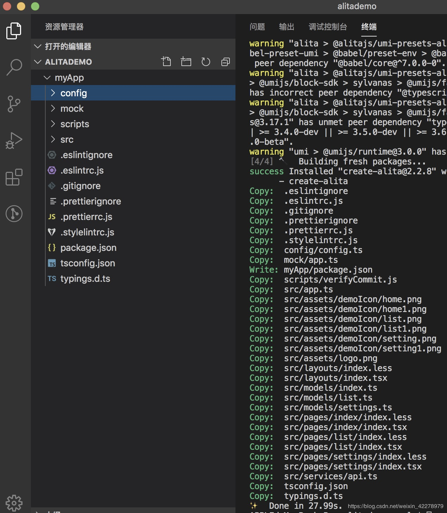
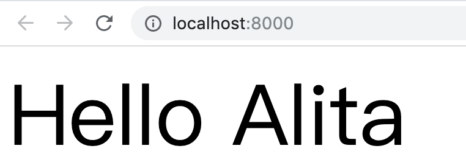
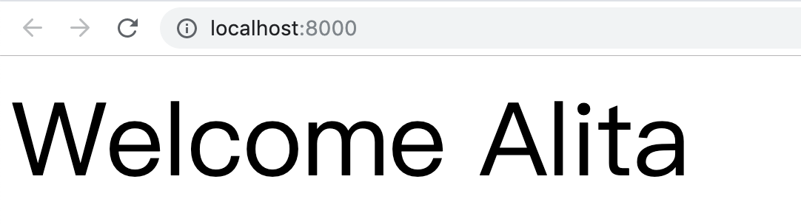

# 快速上手

## 环境准备

在开始之前，请确保你的开发环境已经包含了 Node.js 的开发环境
Alita 需要 Node.js 的 `8.1x` 版本以上

- 检测 Node 版本，可以在终端/控制台窗口中运行命令。
- 要想安装 Node.js，可参考上一小节内容。

```bash
$ node -v
v8.11.3
```

> 注意：这里的版本号只要大于 8.10 就可以了，很多朋友的环境都是 8.9+，可能会出现一些意料之外的问题。

## 第一步 安装 Alita

我们需要使用 Alita 来创建页面 `alita g`，并执行多种开发任务，比如测试 `alita test`、打包`alita build` 和开发 `alita dev` 等。

全局安装 Alita 使用 `npm` 来安装 Alita,请打开终端/控制台窗口，并输入下列命令：

```bash
$ npm install -g alita
```

推荐使用 `yarn` 来安装 Alita,因为 yarn 对于多次执行安装的情况做了缓存，这个在我们前期，经常新建项目的时候，能够节省很多时间。

```bash
$ npm install -g yarn
```

命令行执行结束后，判断 yarn 是否安装成功

```bash
$ yarn -v
1.9.4
```

> 注意：windows 系统需要将 yarn 的 bin 目录添加到环境变量中。全部变量才可用

使用 yarn 安装 Alita

```bash
$ yarn global add alita
```

命令行执行结束后，判断 yarn 是否安装成功

> 如果你上面安装成功了，但是执行 `alita -v` 提示没有找到 alita，那就应该是没有配置 `yarn` 的环境变量。

```bash
$ alita -v

alita@2.2.8
umi@3.0.0
darwin x64
node@v12.14.1
```

> 注意：更多的时候，我们用到的是项目工作空间的 alita，而不是全局的 alita，这个在不同版本 alita 存在差异时，需要留意。

## 第二步 新建一个最简单的 Alita 项目

在你自己的工作空间或者任意目录，执行以下命令：

```bash
# 记得这里需要跟一个项目名字！😍
# 默认创建的是 h5 项目
yarn create alita myApp

# 如果你想创建 pc 项目
yarn create alita myApp --pc

# 这里的项目应用名，后续你可以在项目的 package.json 中修改。

# 当然，你也同样可以用如下命令创建项目，不过推荐使用上面的命令
alita g app myApp
```

> 其中， `myApp` 是项目名称。 `--pc` 是指定生成的项目是 `pc` 项目，默认项目类型为 `h5`。
>
> 默认生成的 `pc` 项目是一个空白(blank)项目，默认生成的 `h5` 项目是一个 `tabs` 项目。

教程中我们创建的是 pc 项目。



**如果想在已创建的项目中切换项目类型，可以参考[官网](https://alitajs.com/building/starting)。**

## 第三步 安装所需插件

```bash
# 进入到项目目录中
$ cd myApp

$ yarn
```

`yarn` 命令执行后，目录下会多出 `node_module` 和 `yarn.lock` 为我们安装的依赖包。

`node_module`：安装所需的依赖包。

`yarn.lock`：依赖包的版本控制。

## 第四步 启动开发服务器

```bash
$ yarn start

✔ success webpack compiled in 3s 49ms
 DONE  Compiled successfully in 3056ms            22:37:57
  App running at:
  - Local:   http://localhost:8000 (copied to clipboard)
  - Network: http://192.168.1.8:8000
```

在浏览器上访问 `http://localhost:8000`:



## 第五步 编辑页面

- 1.打开 src/pages/index/index.tsx
- 2.编辑文件

```diff
- return <div className={styles.center}>Hello {name}</div>;
+ return <div className={styles.center}>Welcome {name}</div>;
```

> alita 项目默认使用 react Hook，不熟悉的小伙伴可以在参考[官网](https://react.docschina.org/docs/getting-started.html)。

3.保存文件



> umi 默认开启热更新功能，保存之后，就能直接在页面中看到变化。
